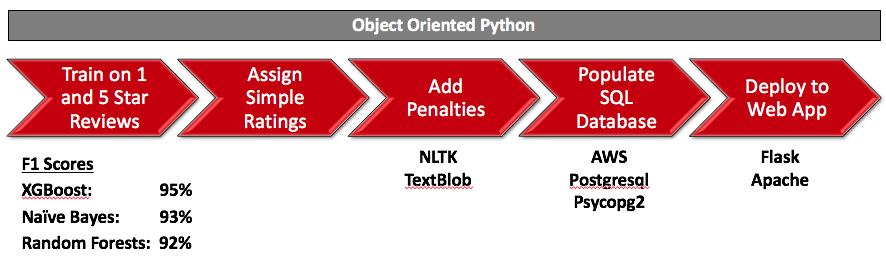

## Riffle
The five star rating system is **broken**. Looking at the 4.1 million reviews in the
[Yelp Academic Dataset](https://www.yelp.com/dataset_challenge),
**over 66% of the review are positive** (4 or 5 stars). Furthermore,
these reviews are not written by professional critics. There is a lot of bias,
inaccuracy and inconsistency in reviews.

So as a **smart consumer**, what do you do when you have an important date coming
up and need to choose between several trendy restaurants that are all rated 4.5 stars?
You [riffle](https://www.google.com/search?hl=en&q=riffle+definition) through reviews and try to pick out key features that are important
to you.

There are at least a couple problems with that: you can only parse
a handful of reviews out of potentially thousands, and you may not effectively
pick out those features that determine quality reviews.

Don't rely on 5 star ratings to make important decisions. Let **Riffle** do
the work for you.

Check it out at [riffle.hasanhaq.com](http://riffle.hasanhaq.com)

## Usage
* You are in Vegas for a weekend and want steak, but all the [top steakhouses](https://www.yelp.com/search?find_desc=Best+Steakhouse&find_loc=Las+Vegas%2C+NV) are rated 4-5 stars. How do you decide?
* [Riffle it!](http://riffle.hasanhaq.com)
  * Choose the steakhouses you want to compare.
    * Try: Prime, Gallagher's, and THE Steak House
* Riffle will analyze the Yelp reviews, make adjustments, and compare them for you.

Currently only the top 10,000 Las Vegas locations (by number of Yelp reviews) are supported. If there is interest then I will add more locations.

## Methodology

I used machine learning techniques to train my model on the "language"
that people use for **favorable** and **unfavorable** reviews.

Then, I go through all the reviews in the dataset and model them as positive
or negative and spit out a percentage. No more 5 star craziness. Think
[Rotten Tomatoes](http://www.rottentomatoes.com).

Next, I penalize the weighting of each review based on subjectivity,
polarity, and word count. I use [NLTK](http://www.nltk.org/) sentiment analysis during this
process.

Finally, I populated a [Postgresql](https://www.postgresql.org/) database, pushed it to the
cloud, and built a [Flask](http://flask.pocoo.org/) web app to analyze the results.

## Supplemental Materials
[Jupyter Notebook](riffle.ipynb)

[Presentation - PPT](https://github.com/hh2010/riffle/blob/master/ppt/riffle.pptx?raw=true)

[Presentation - PDF](ppt/riffle.pdf)

## Contact
If you have any questions or comments on this project, you can find me below:

E-mail: [hasan.haq@gmail.com](mailto:hasan.haq@gmail.com)

Twitter: [@hhaq2010](http://www.twitter.com/hhaq2010)

Website: [www.hasanhaq.com](http://www.hasanhaq.com)
